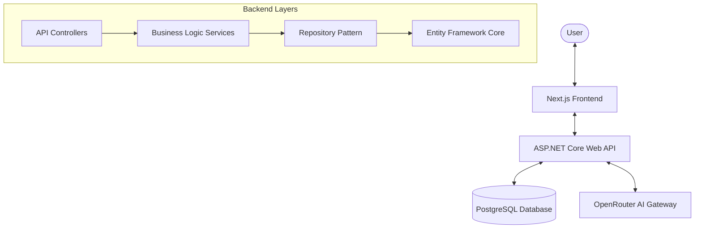

# Private Knowledge Q&A – Mini Workspace

A secure, full-stack RAG (Retrieval-Augmented Generation) application designed for private document exploration. This project demonstrates a clean, layered architecture with a focus on security, performance, and developer experience.

## 🏗️ Architecture Overview

The system follows a decoupled Client-Server architecture with a clean separation of concerns.



### Engineering Highlights
- **Repository Pattern**: Abstracted data access for testability and flexibility.
- **RAG Implementation**: Intelligent document chunking and context-aware prompting via LLM.
- **Security-First Config**: 100% environment-based configuration; zero secrets committed.
- **Centralized Error Handling**: Robust middleware for consistent API responses.
- **Health Monitoring**: Dedicated status page monitoring service, database, and AI health.

## 🛠️ Tech Stack

- **Frontend**: Next.js 14+ (App Router), TypeScript, Framer Motion, Lucide Icons.
- **Backend**: ASP.NET Core 8 Web API, C#.
- **Database**: PostgreSQL (Entity Framework Core).
- **AI/LLM**: OpenRouter (Multiplexer) for model flexibility (Llama-3, GPT-4o-mini).
- **Hosting**: Vercel (Frontend), Render (Backend/PostgreSQL).

## 🚀 Local Setup

### 1. Prerequisites
- [.NET 8 SDK](https://dotnet.microsoft.com/download/dotnet/8.0)
- [Node.js 18+](https://nodejs.org/)
- [PostgreSQL](https://www.postgresql.org/download/)

### 2. Environment Configuration
Copy the template and fill in your credentials:
```bash
cp .env.example .env
```
Key requirements:
- `OpenAI__ApiKey`: Your OpenRouter API key.
- `ConnectionStrings__DefaultConnection`: Local or remote PostgreSQL string.

### 3. Backend Setup
```bash
cd backend
dotnet ef database update
dotnet run
```

### 4. Frontend Setup
```bash
cd frontend
npm install
npm run dev
```

## 🏥 Health Checks

The application includes a built-in health monitoring system accessible via:
- **API Endpoint**: `/api/status` (or standard ASP.NET `/health`)
- **UI Dashboard**: `/status` page

It monitors:
- Database connectivity.
- LLM API responsiveness.
- Backend service uptime.

## 🔒 Security & Best Practices

- **Zero Hardcoding**: All sensitive values (keys, strings) are read from Environment Variables or User Secrets.
- **Sanitized Repository**: A professional `.env.example` is provided; `.env` files are strictly gitored.
- **CORS Policy**: Configured strictly to allow only authorized origins in production.

## 🌐 Deployment Links

- **Live Demo**: [Coming Soon](https://your-frontend.vercel.app)
- **API Documentation**: [Coming Soon](https://your-backend.onrender.com/swagger)

---
*Created as part of a technical workspace demonstration.*
